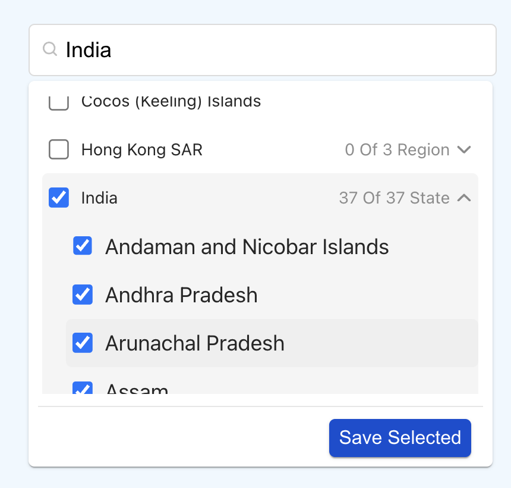
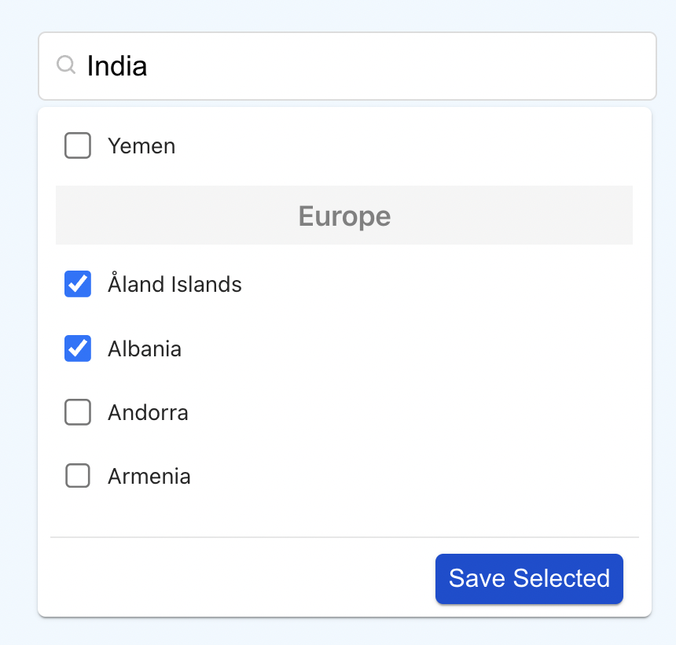
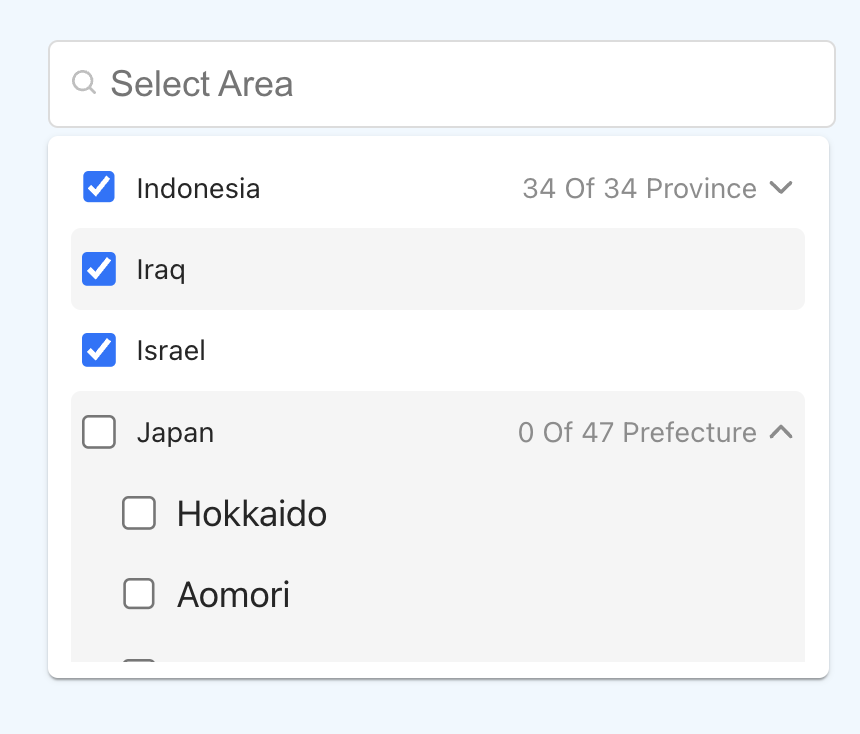

# REACT MULTI-NESTED-SELECT DROPDOWN 


💥💥💥 **React Library for SCREEN RECORDER . Tiny and Efficient. [Check it Out](https://www.npmjs.com/package/recorderweb)** 💥💥💥


## Description

A React component which provides multi select functionality for nested option list of continent -> country -> state with various features like selection limit, CSS customization, checkbox, search option, disable preselected values, control nested level keyboard navigation for accessibility and grouping features. Also it has feature to behave like normal dropdown(means single select dropdown).







## 🎉🎉 New features in >=1.0.1  
✨ Easy to use  
🍃 Light weight  
🚀 Typescript  


## 🏳️‍🌈 Getting Started 

## 1. Installation 🔧
```
npm install multi-nested-select

yarn add multi-nested-select
```
----
## 2. Demo 👁️
[React-multi-nested-select-dropdown](https://codesandbox.io/s/multi-select-nested-options-5eyyu4?file=/src/App.js)

----
## 3. Basic Usage 📑
```js
import NestedSelect from "multi-nested-select";;


callbackFunction(selectedItem) {
    ...
}

onChange(e_selected) {
    ...
}

<NestedSelect
    buttonContent="Done" // For custom text for button
    enableButton={true}  // To show or hide the button 
    state={true}         // show the nested level state 
    continent={true}     // show and hide the continent 
    onChange={(val) => onChange(val)}  // while adding/removing this onchange will call
    callback={(val) => callbackFunction(val)}  //on submit or save button callback()
/>


```

----

## 4. Props 💬

| Prop  | Type  | Default | Description |
|:--------- | :---- | :----   |:----  |
| `callback` | `function` | `func` | Callback function will invoked on click of save button
| `onSearch` | `function` | `func` | Callback function will invoked on change of input feild event (similar to onChange). Params are searchValue
| `onChange` | `function` | `func` | Callback function will invoked on selection or removal of options. Params are selectedList
| `disabled` | `boolean` | `false` | Make it `true` to disable the select input feild.
| `selectedValue` | `array` | `[]` | Preselected value to persist in dropdown
| `showCheckbox` | `bool` | `true` | To display checkbox option in the dropdown
| `selectLimit` | `number` | `-1` | You can limit the number of items that can be selected in a dropdown
| `placeholder` | `string` | `Select Area` | Placeholder text
| `buttonContent` | `string` | `Save Selected` | To display the button text content`
| `width` | `number` | `360` | width of the component to display dropdown.
| `enableButton` | `bool` | `true` | Make it `false` to hide the button.
| `trailing` | `bool` | `true` | Make it `false` to hide the trailing message ex- 0 of 24 selected'.
| `state` | `bool` | `true` | Option to show or hide the state option list .make it `false` to hide state list.
| `style` | `object` | `{}` | CSS Customization for multi-nested-select. Refer below object for **css customization.
| `continent` | `bool` | `true` | Option to show or hide the continent option list .make it `false` to hide continent list.
| `id` | `string` | `''` | Id for the search container / input field..
| `className` | `string` | `''` | Class for the input field.
| `...props` | `attribute` | `''` | pass any attribute other than above listed, it will default assigned to input feild as their own attributes.
----


## 5. CSS Customization 🌈

```css
For customization of CSS we have provide className based support 

* For input box -- 
Pass props as inputClass= " ... your class name... "
ex- <SelectCountry 
      inputClass="myCustom_text"
    />


* For drop-Down box -- 
Pass props as dropDownClass= "... your class name... "
ex- <SelectCountry 
      dropDownClass="myCustom_dropbox"
    />

* For drop-Down box -- 
Pass props as dropDownClass= "... your class name... "
ex- <SelectCountry 
      buttonClass="myCustom_button"
    />

Now create your own .css or .scss file to define that class style according to your need.

Ex -

Create `custom.css` file in your repo


.myCustom_dropbox{
    height: 200px;
    z-index: 1000;
}

```

----

## 8. Licence 📜
MIT

## 9. Development
This package is build with typescript, react js and webpack .

## 10. Contributions
Contributions are welcome, please open an issue and preferrably file a pull request.

Opening Issue Please share sample code using codesandbox.com or stackblitz.com to help me re-produce the issue.

## 11. Playground
https://codesandbox.io/s/multi-select-nested-options-5eyyu4?file=/src/App.js